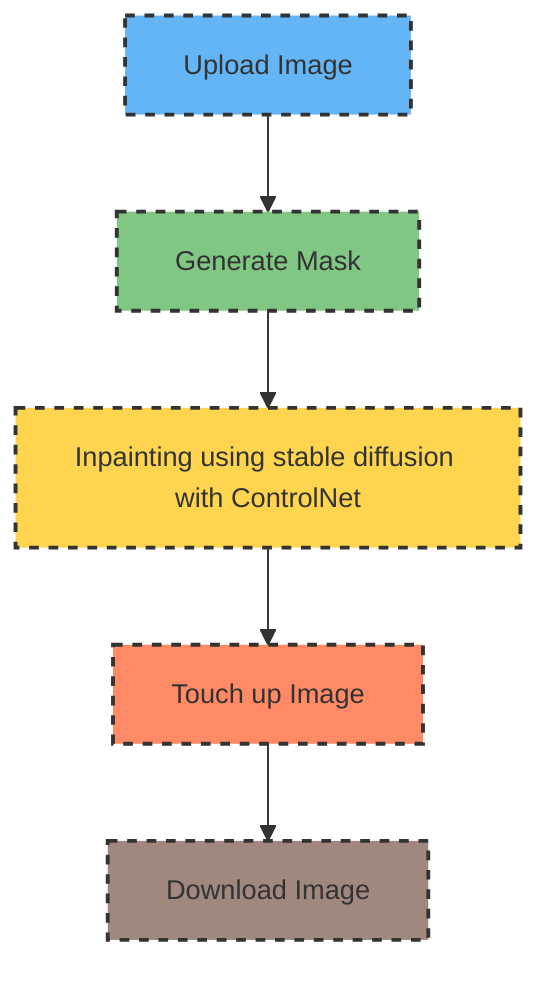

# **Touch-Up-The-Hair**

## Image Processing Workflow

This section describes the workflow for processing images using our application.

## Objective
The objective of this project is to touch up hair in the image to match the minority hair color to the previously applied predominant color, resulting in a beautiful, uniform single-color hair appearance.

## Project Overview
This project employs stable diffusion inpainting with ControlNet to achieve the desired hair color touch-up. The algorithm utilizes a minority hair color mask to guide the inpainting process.

## Usage
1. Clone this repository to your local machine.
2. Open and run the notebook `touch_up_the_hair.ipynb` in Google Colab or any compatible environment.
3. Upload your input images to the `input_dir` folder.
4. Follow the instructions provided in the notebook to process the images.
5. Retrieve the processed images from the `output_dir` folder.

## Repository Structure
- `touch_up_the_hair.ipynb`: Contains the Python code for the hair color touch-up process.
- `input_dir/`: Directory to upload input images.
- `output_dir/`: Directory where the processed images will be saved.
- `models/`: Directory to store required models.

## Models
- `selfie_multiclass_256x256.tflite`: Mediapipe model for segmenting hair in images.
